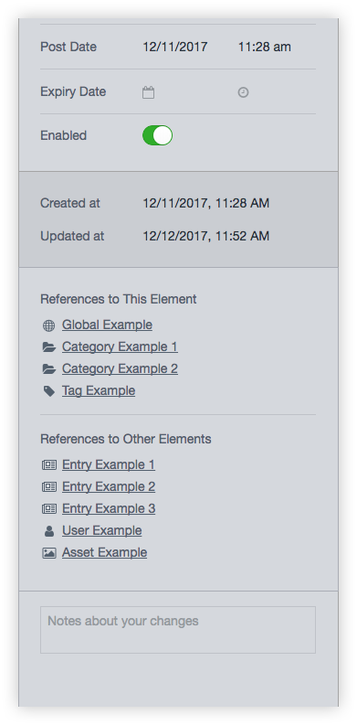

# Element Map for Craft 3

This plugin adds a widget to the sidebar of full-page element editors that allows content administrators to see, at a glance, the relationships between elements.

## Requirements

* Craft CMS 3.0.0-RC1 or above

## Installation

1. Open a terminal and navigate to your project folder:

```bash
cd /path/to/project
```

2. Require the package to download it via Composer:

```bash
composer require charliedev/element-map
```

3. Install the plugin on the `Settings -> Plugins` page in the Craft control panel.

**--- or ---**

3. Install the plugin via the command line:

```bash
./craft install/plugin element-map
```

## Usage



When editing an entry, category, or user in the full-page editor, you will be presented a panel in the sidebar with two lists.

1. **References to This Element** lists the elements which contain the currently edited element somewhere in their fields. These elements could be entries, categories, tags, assets, users, or globals.

2. **References to Other Elements** lists the elements which the currently edited element contains somewhere in its fields. These elements could be entries, categories, tags, assets, or users.

Both lists provide links to the related elements' editors or control panel sections for quick access.

---

*Built for [Craft CMS](https://craftcms.com/) by [Charlie Development](http://charliedev.com/)*
